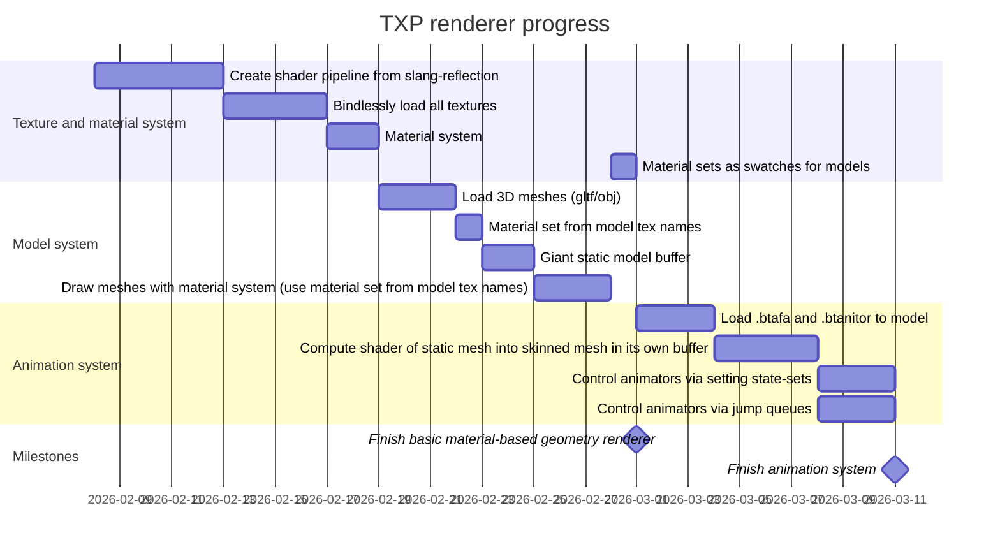
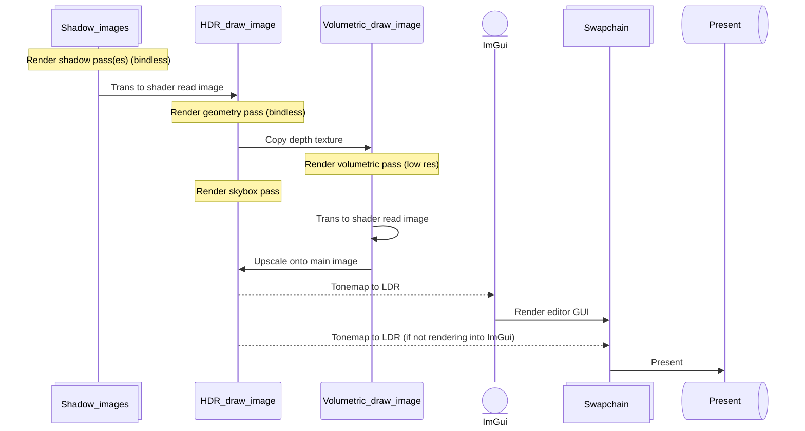

# Thea Cross-Platform (TXP) Renderer

C++20 cross-platform renderer library.

## Usage

Below is a minimal example of setting up the renderer with 1 texture, 1 material, 1 material-set, 1 model.

```cpp
#include "txp_renderer_public.h"

#include <cstdint>


int32_t main()
{
    TXP::Renderer r{ "My renderer test!", 1280, 720 };

    r.add_texture("default_tex", ".ktx2");
    r.add_material("default_mat", "default_shader", { { "texture0", "default_tex" } });
    r.add_material_set("default_mat_set", { "default_mat" });
    r.add_model("default_model", ".glb", "default_mat_set");

    auto ro0_key = r.create_render_obj({
        .layer      = TXP::RENDER_LAYER_DEFAULT,
        .model_name = "default_model",
    });

    r.run();

    return 0;
}
```


## Software

- Clang
    - win64: 20.1.X (install llvm for windows and ninja)
    - macOS: 17.0.0 (default)

- Vulkan SDK
    > Include shader symbols.
    - win64: 1.4.341.0
    - macOS: 1.4.335.1 (note: contains MoltenVK 1.4.2)
        - System Global Installation

- vk-bootstrap v1.4.342

- VulkanMemoryAllocator v3.3.0


## Helper Software

### KTX-Sofware

Download from here (version 4.4.2): [click here](https://github.com/KhronosGroup/KTX-Software/releases/tag/v4.4.2)

For macOS, install the pkg. (uninstall with `sudo ktx-uninstall`)

For Windows, download the .exe and place it somewhere where it's available from PATH.


## Details

For Win64, macOS, and Linux, this renderer uses Vulkan 1.3 (MacOS being thru MoltenVK).

For other platforms, it is not planned yet.


## Progress

Below is a chart showing the timeline of tasks.




## Render Graph

Below is the flow of data for the render graph.


